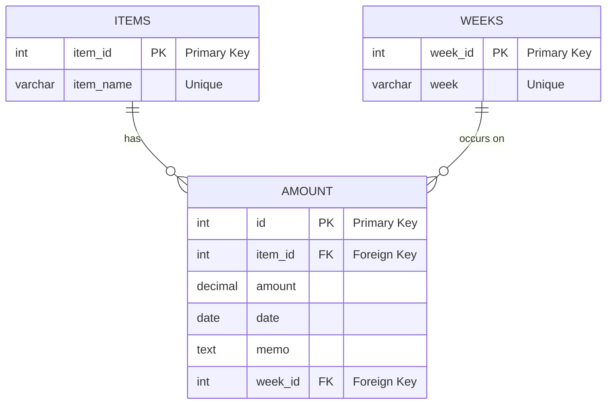

```mermaid
erDiagram
    ITEMS {
        int item_id PK "Primary Key"
        varchar item_name "Unique"
    }
    
    WEEKS {
        int week_id PK "Primary Key"
        varchar week "Unique"
    }
    
    AMOUNT {
        int id PK "Primary Key"
        int item_id FK "Foreign Key"
        decimal amount
        date date
        text memo
        int week_id FK "Foreign Key"
    }
    
    ITEMS ||--o{ AMOUNT: "has"
    WEEKS ||--o{ AMOUNT: "occurs on"
```